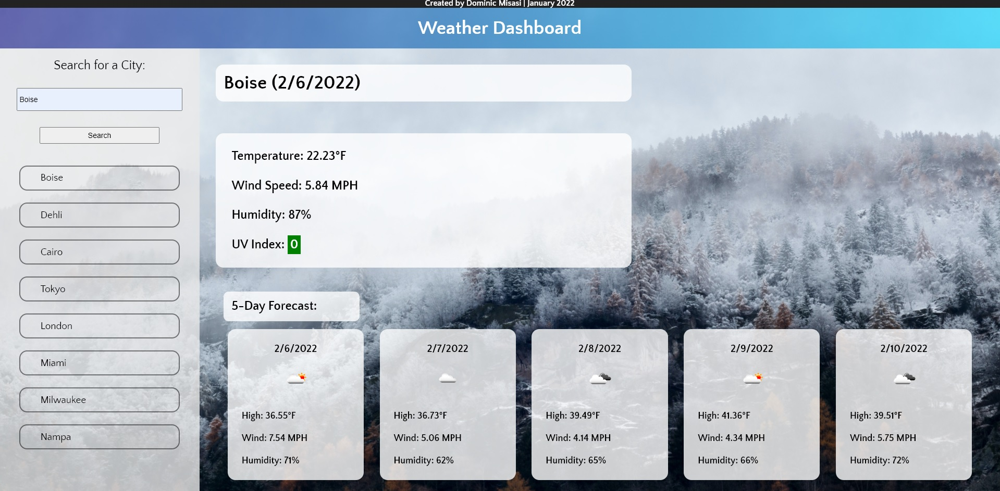

# BC_CH06_Weather-Dashboard

A simple weather dashboard using the OpenWeather One Call API

<b>Deployment Link: </b> https://meshtatsuo.github.io/BC_CH06_Weather-Dashboard/ 

## Features

<ul>
<li> Uses geocode API from OpenCageData to fetch a given city's coordinates</li>
<li> Uses OpenWeather's One Call API to fetch weather info for user's chosen city</li>
<li> Displays current weather information along with a five day forecast</li>
<li> Saves user's last 8 searches and displays them in the aside for easy access</li>
<li> Background image updates based on weather of currently viewed city.</li>
</ul>

## Preview

